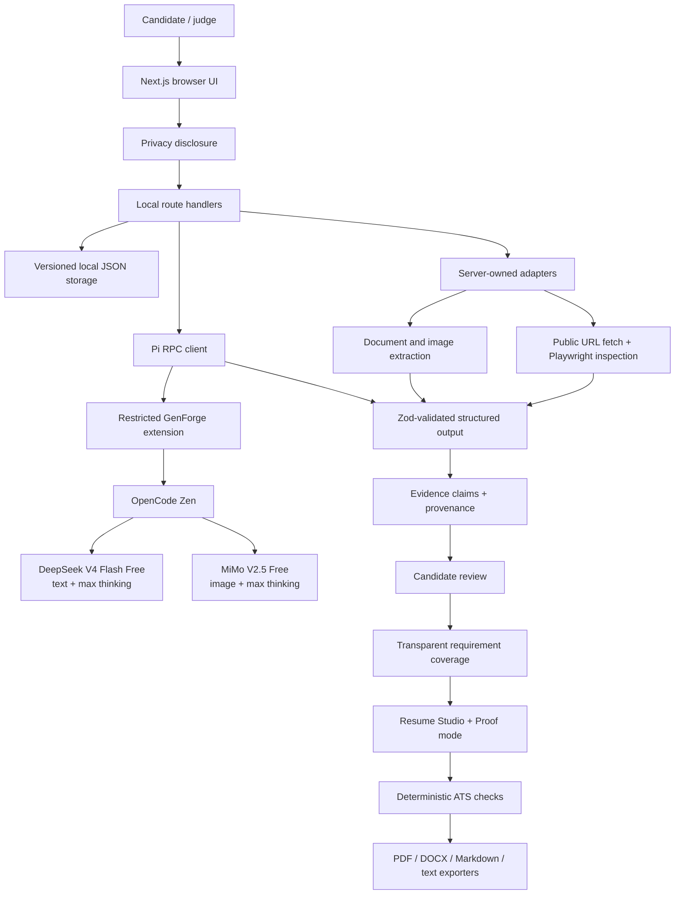
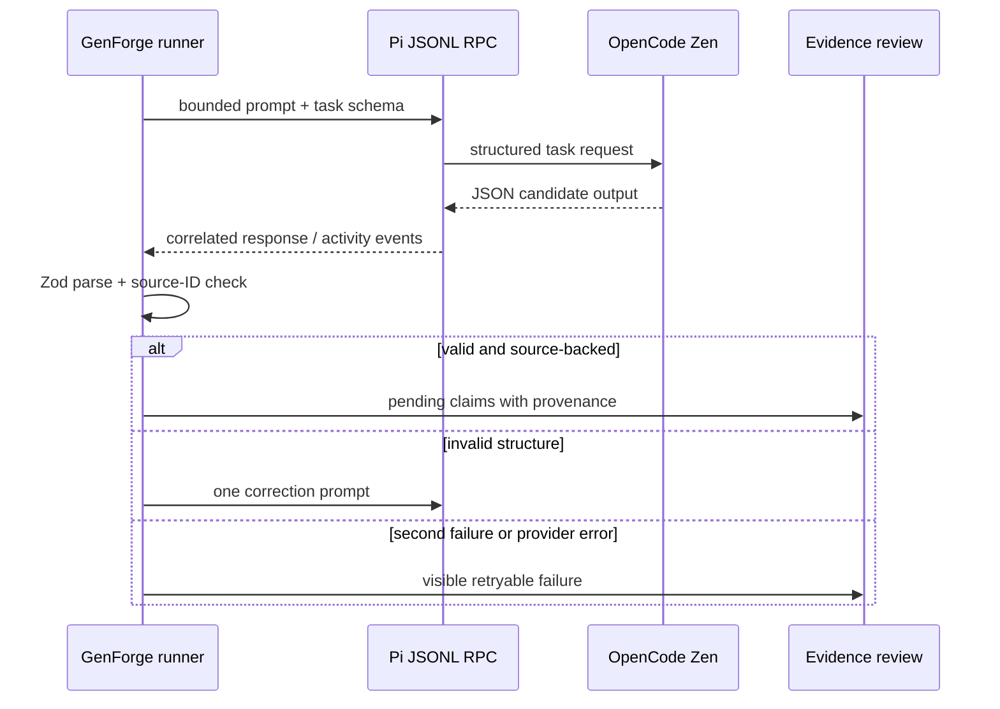

# GenForge — Live Career Agent

> **AI can draft the sentence. GenForge makes it earn its place.**

<p align="center">
  <strong>A local-first, evidence-backed career workspace that turns candidate facts into a targeted resume judges can audit.</strong>
</p>

<p align="center">
  <a href="#the-90-second-judge-tour">90-second tour</a> ·
  <a href="#architecture-in-one-screen">Architecture</a> ·
  <a href="#the-ai-boundary">AI boundary</a> ·
  <a href="#run-it">Run it</a> ·
  <a href="#submission-map">Submission map</a>
</p>

<p align="center">
  <a href="https://github.com/jagathsrujan/genforge-live-career-agent/actions/workflows/ci.yml"></a>
  <a href="LICENSE"></a>
  
  
</p>

## The judge’s 30-second takeaway

Most resume generators optimize for fluent wording. GenForge optimizes for
**defensible wording**:

1. Collect candidate facts and source material.
2. Research public sources through bounded, server-owned adapters.
3. Ask Pi/OpenCode Zen for structured claims, not an unrestricted chat.
4. Let the candidate approve or reject each claim.
5. Map approved evidence to one target role.
6. Draft the resume, then show the evidence trail behind every bullet.
7. Refuse to export unsupported or rejected claims.

### The hook: Proof mode

Click a resume bullet and GenForge reveals:

- the claim behind the wording;
- the exact source IDs and excerpts;
- whether the wording came from the user, the agent, or an edit;
- the approval status and inclusion decision.

That makes the product’s central promise visible in one interaction: **a
resume claim is not ready because it sounds good; it is ready because it has
evidence.**

<details open>
<summary><strong>Why this is interesting technically</strong></summary>

| Design decision | What it prevents or enables |
| --- | --- |
| Evidence claims are first-class domain objects | Facts do not disappear into a final blob of generated text. |
| Pi runs through restricted JSONL RPC | The model cannot silently edit files, browse freely, or submit applications. |
| Every model response is Zod-validated | Invalid structure becomes a visible retryable failure. |
| Match scores mean requirement coverage | The UI does not pretend to predict hiring probability. |
| Deterministic exporters own formatting | PDF/DOCX output cannot invent content while rendering. |
| Local storage and explicit privacy disclosure | The user can see what leaves the machine before a live run. |

</details>

## The 90-second judge tour

| Time | Action | What to notice |
| --- | --- | --- |
| 0:00 | Launch the local app and choose **Load demo workspace** | Synthetic inputs are prefilled, but generated output is not replayed. |
| 0:15 | Open **Privacy boundary** | The outbound candidate fields, files, URLs, provider, and models are explicit. |
| 0:30 | Start the live run | Observable events show extraction, research, model routing, and reconciliation. |
| 0:50 | Open **Evidence** | Claims are pending until reviewed; rejected claims cannot flow forward. |
| 1:05 | Open **Target Job** | Requirement coverage is matched, partial, missing, or unsupported—not a black-box score. |
| 1:20 | Generate a resume and select a bullet | Proof mode connects the bullet back to its source evidence. |
| 1:35 | Open **Export** | ATS checks run before deterministic PDF, DOCX, Markdown, or text export. |

The synthetic demo uses real Pi/model calls when configured. It never silently
substitutes fake AI output after a provider failure. In CI, a fake Pi child
process exists only to make automated tests deterministic; it is not a product
fallback.

## Architecture in one screen



### The data flow, without the marketing layer

```text
Browser
  -> POST /api/workspaces/:id/runs
  -> privacy manifest is re-built from the actual workspace
  -> local extraction and public research adapters run with bounds
  -> Pi receives a bounded prompt through LF-delimited JSONL RPC
  -> response is parsed by a domain-specific Zod schema
  -> evidence claims preserve source IDs, excerpts, and provenance
  -> approved evidence is mapped to job requirements
  -> resume wording is drafted, checked, and rendered deterministically
```

## The AI boundary

GenForge uses AI where language and reconciliation help, and keeps safety,
storage, and rendering deterministic.

### Model routing

| Input or task | Route | Default |
| --- | --- | --- |
| Candidate evidence, job analysis, reconciliation, resume drafting | Pi → OpenCode Zen → DeepSeek | `opencode/deepseek-v4-flash-free` with `max` thinking |
| Uploaded image evidence | Pi → OpenCode Zen → MiMo | `opencode/mimo-v2.5-free` with `max` thinking |
| File extraction, URL safety, browser inspection, ATS checks, exports | Local server-owned code | No model required |

Pi is launched with a restricted boundary:

```text
pi --mode rpc --no-session --no-builtin-tools \
  --extension <GenForge extension> \
  --provider opencode \
  --model opencode/deepseek-v4-flash-free \
  --thinking max
```

The GenForge extension exposes only bounded task tools. It does not grant the
model arbitrary shell, filesystem, network, login, CAPTCHA, or application-
submission capabilities.

### Structured output and failure behavior



No hidden chain-of-thought or raw model transcript is rendered. Judges see
short user-facing events such as “GitHub profile analyzed” and “2 sources
reconciled,” not private reasoning.

## Trust boundaries and honest limitations

| Boundary | Allowed | Explicitly not allowed |
| --- | --- | --- |
| Candidate machine | Workspace JSON, attachments, exports, redacted events | Credentials or API keys in workspace data |
| Public research | Public HTTP fetch plus browser inspection with timeout/size/redirect checks | Local/private-network targets, login, CAPTCHA bypass, or side effects |
| LinkedIn | User-provided export or screenshot | Scraping or credential storage |
| Pi/OpenCode | Bounded source context and structured task prompts | Unrestricted tools or hidden file edits |
| Resume exporter | Approved claims and deterministic layout | New facts or model-written formatting decisions |

This is a local-only release; it does not submit job applications. Live runs
require the user’s own OpenCode credential. The public repository contains only
synthetic fixtures and no personal candidate profile.

## Feature matrix

| Capability | Included | Proof in the repository |
| --- | --- | --- |
| Five-workspace candidate flow | ✅ | Candidate, Evidence, Target Job, Resume Studio, Export |
| Source-backed evidence claims | ✅ | `EvidenceClaim` schema, review states, source excerpts |
| Proof mode | ✅ | Bullet → claim → source provenance path |
| GitHub and public web research | ✅ | Dual direct-fetch and Playwright adapter |
| LinkedIn handling | ✅ | Export/screenshot intake only |
| Pi/OpenCode live workflow | ✅ | RPC client, restricted extension, model routing |
| Transparent job match | ✅ | Matched / partial / missing / unsupported coverage |
| ATS checks | ✅ | Sections, text extraction, headings, dates, keywords, unsupported claims |
| Export formats | ✅ | PDF, DOCX, Markdown, plain text |
| Local privacy boundary | ✅ | Consent manifest, redaction, atomic storage, safe uploads |
| Application submission and tracking | Intentionally out of scope | See `docs/LIMITATIONS.md` |

## Run it

### Requirements

- Node.js 20.11 through 22.x
- pnpm 9 via Corepack
- Pi installed for live runs
- An OpenCode Zen key for live model calls

### Fastest local start

```bash
git clone https://github.com/jagathsrujan/genforge-live-career-agent.git
cd genforge-live-career-agent
corepack enable
pnpm install --frozen-lockfile
pnpm resume check
pnpm resume agent
```

Open `http://127.0.0.1:3000`, then select **Load demo workspace**.

If Node 22 is installed through Homebrew on Apple Silicon:

```bash
export PATH="/opt/homebrew/opt/node@22/bin:$PATH"
pnpm resume agent
```

### Live configuration

```bash
cp .env.example .env.local
# Add your own rotated key to .env.local; never commit it.
pnpm resume check
pnpm resume agent
```

The CLI reports the runtime, Pi availability, model IDs, storage location, and
whether a credential is present without printing secrets. Use
`GENFORGE_NO_OPEN=1` for server-only operation or `GENFORGE_PORT=3001` if port
3000 is occupied.

## Submission map

The technical explanation is intentionally visible here first. These linked
documents provide the deeper version a judge can inspect after the first pass:

| Judge question | Start here |
| --- | --- |
| What is the product thesis? | This README’s [judge takeaway](#the-judges-30-second-takeaway) |
| How does the architecture work? | [Architecture document](docs/ARCHITECTURE.md) |
| How is AI integrated safely? | [AI integration notes](docs/AI-INTEGRATION.md) |
| What design decisions were made? | [Technical write-up](docs/WRITEUP.md) and [decisions](docs/DECISIONS.md) |
| Can I reproduce the demo? | [Demo script](docs/DEMO_SCRIPT.md) |
| What is intentionally missing? | [Limitations](docs/LIMITATIONS.md) |
| Is this repository public-safe? | [Public repository checklist](docs/PUBLIC_REPO_CHECKLIST.md) |
| What does the output look like? | [Synthetic sample PDF](artifacts/synthetic/sample-resume.pdf) |

## Release checks

```bash
pnpm public:check
pnpm typecheck
pnpm lint
pnpm test
pnpm e2e
pnpm build
```

The test suite covers domain validation, migrations, provenance, redaction,
upload safety, SSRF rejection, Pi JSONL correlation, cancellation, SSE replay,
match coverage, storage atomicity, and all export formats. The Playwright suite
also covers rapid candidate entry, demo reset, live workflow orchestration, and
reviewed exports using a fake Pi child process only inside tests.

## Public-repository safety

The repository is MIT licensed and intentionally excludes `.env.local`, API
keys, personal resumes, LinkedIn screenshots, attachments, run logs, and
generated personal documents. Run `pnpm public:check` before every push. Read
the [security policy](SECURITY.md) and [contributing guide](CONTRIBUTING.md)
before opening a change.

## License

MIT. See [LICENSE](LICENSE).
