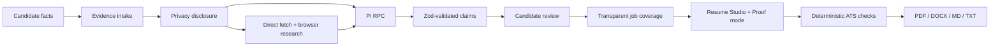

# GenForge — Live Career Agent

> A resume should hold up under a question.

[](https://github.com/jagathsrujan/genforge-live-career-agent/actions/workflows/ci.yml)
[](LICENSE)

GenForge is a local-first AI career workspace for turning candidate facts and
source material into a targeted, reviewable resume. Every included bullet keeps
its claim IDs, source IDs, excerpts, and wording provenance attached.

<p align="center">
  <a href="#start-here">Start here</a> ·
  <a href="#how-it-works">How it works</a> ·
  <a href="docs/ARCHITECTURE.md">Architecture</a> ·
  <a href="docs/AI-INTEGRATION.md">AI integration</a> ·
  <a href="docs/WRITEUP.md">Technical write-up</a> ·
  <a href="#release-checks">Release checks</a>
</p>

## Start here

<details open>
<summary><strong>1. Install and launch the local app</strong></summary>

Requirements: Node.js 20.11 through 22, Corepack-enabled pnpm 9, and Pi for
live runs.

```bash
corepack enable
pnpm install --frozen-lockfile
pnpm resume check
pnpm resume agent
```

The CLI binds to `127.0.0.1:3000`. Use a different local port when needed:

```bash
GENFORGE_PORT=3001 pnpm resume agent
```

Use `GENFORGE_NO_OPEN=1` when the server should stay in the terminal.

</details>

<details>
<summary><strong>2. Try the synthetic demo</strong></summary>

Choose **Load demo workspace** in the app. The candidate, source excerpts,
LinkedIn screenshot fixture, and target role are synthetic and safe for a
screen recording. The demo still requires an explicit privacy disclosure and
real Pi/model calls for generated output; it never replays fake AI results.

Reset a clean demo workspace from a running server:

```bash
pnpm demo:reset
```

</details>

<details>
<summary><strong>3. Enable live Pi/OpenCode Zen runs</strong></summary>

```bash
cp .env.example .env.local
# Add your own key to .env.local; never commit that file.
pnpm resume check
pnpm resume agent
```

Default routing is DeepSeek V4 Flash Free with `max` thinking for text and MiMo
V2.5 Free with `max` thinking for image inputs. Both models are configurable.

</details>

## Why GenForge exists

Most resume generators optimize for fluent wording. GenForge optimizes for
defensible wording: collect evidence, reconcile it, let the candidate approve
claims, map those claims to one target role, and only then draft an exportable
resume. The score describes reviewed requirement coverage, not hiring
probability or model confidence.

## How it works



The five workspaces are:

| Workspace | Purpose | Trust boundary |
| --- | --- | --- |
| Candidate | Facts, uploads, and public URLs | Personal details stay local unless explicitly disclosed |
| Evidence | Review claims and source excerpts | Pending or rejected claims cannot enter a resume |
| Target Job | Research one target and map requirements | Coverage is evidence-based, not a hiring prediction |
| Resume Studio | Draft, edit, and inspect proof | Bullets retain claim and source IDs |
| Export | Validate and render | Exporters do not ask the model to rewrite content |

## Challenge submission map

This repository is structured for the GenForge mini challenge: an end-to-end AI
resume generator, public source code, setup documentation, architecture and AI
write-up, synthetic sample artifact, and a short demo recording.

| Requirement | Repository evidence |
| --- | --- |
| Working end-to-end app | Five-workspace Next.js UI and local route handlers |
| AI integration | [AI integration notes](docs/AI-INTEGRATION.md) and Pi RPC client |
| Public source and setup | This README, [CONTRIBUTING.md](CONTRIBUTING.md), and CI |
| Architecture/design explanation | [Architecture](docs/ARCHITECTURE.md) and [technical write-up](docs/WRITEUP.md) |
| Demo artifact | [`artifacts/synthetic/sample-resume.pdf`](artifacts/synthetic/sample-resume.pdf) |
| Demo video | Add the public recording link in [docs/DEMO_SCRIPT.md](docs/DEMO_SCRIPT.md) |

## Trust and privacy

GenForge is local-only by default. Candidate data, attachments, generated files,
and redacted run events live in the configured local data directory. The browser
never receives the OpenCode key.

Before the first live run, the app shows the actual candidate fields, source
IDs, file names, public URLs, provider, and selected models that will be used.
The app does not log in to external sites, submit applications, store
credentials, scrape LinkedIn, bypass CAPTCHAs, or silently substitute fake AI
output after a provider failure.

The public repository intentionally contains only synthetic fixtures. Do not
commit `.env.local`, API keys, personal URLs, resumes, screenshots, attachments,
run logs, or generated personal documents. Run `pnpm public:check` before every
push.

## Configuration

| Variable | Purpose | Default |
| --- | --- | --- |
| `OPENCODE_API_KEY` | OpenCode Zen key used by Pi | Required for live runs |
| `GENFORGE_PI_MODEL` | Text model ID | `opencode/deepseek-v4-flash-free` |
| `GENFORGE_PI_THINKING` | Text thinking level | `max` |
| `GENFORGE_PI_IMAGE_MODEL` | Image model ID | `opencode/mimo-v2.5-free` |
| `GENFORGE_PI_IMAGE_THINKING` | Image thinking level | `max` |
| `GENFORGE_DATA_DIR` | Local workspace directory | OS application support directory |
| `GENFORGE_HOST` | Bind address | `127.0.0.1` |
| `GENFORGE_PORT` | Local server port | `3000` |
| `GENFORGE_NO_OPEN` | Do not open a browser | `0` |

`pnpm resume check` reports runtime and configuration state without printing
secrets.

## AI boundary in one minute

<details>
<summary>What Pi can and cannot do</summary>

Pi runs through RPC with `--no-session` and `--no-builtin-tools`. GenForge owns
file extraction, public URL safety, browser research, local storage, schema
validation, and deterministic exports. Pi receives bounded context and can
return structured analysis; it does not receive arbitrary shell, filesystem, or
network tools.

Every structured response is parsed with Zod. One correction prompt is allowed
after invalid output; the second failure is visible and retryable. Hidden
chain-of-thought and raw model transcripts are never rendered as activity.

</details>

## Release checks

```bash
pnpm public:check
pnpm typecheck
pnpm lint
pnpm test
pnpm e2e
pnpm build
```

The automated browser suite uses a fake Pi child process only in tests. It is
not a product fallback. Read [docs/TEST_REPORT.md](docs/TEST_REPORT.md) for the
release rehearsal and [docs/LIMITATIONS.md](docs/LIMITATIONS.md) for honest
boundaries.

## Repository guide

- [Architecture](docs/ARCHITECTURE.md) — system boundaries and recovery paths.
- [AI integration](docs/AI-INTEGRATION.md) — routing, schemas, provenance, and failure behavior.
- [Technical write-up](docs/WRITEUP.md) — product thesis and design decisions.
- [Demo script](docs/DEMO_SCRIPT.md) — a two-to-three-minute recording plan.
- [Public repository checklist](docs/PUBLIC_REPO_CHECKLIST.md) — release hygiene.
- [Security policy](SECURITY.md) — private vulnerability reporting guidance.
- [License](LICENSE) — MIT.

## Contributing

Read [CONTRIBUTING.md](CONTRIBUTING.md) before opening a change. Keep personal
candidate data out of issues, fixtures, screenshots, logs, and pull requests.
