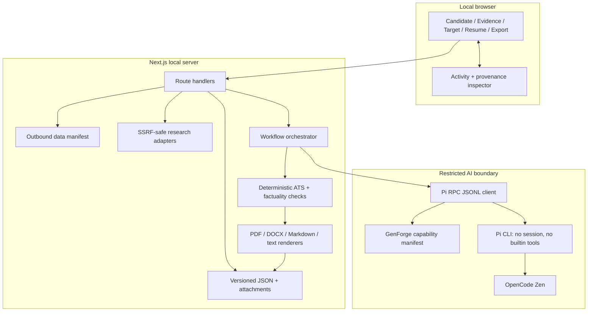
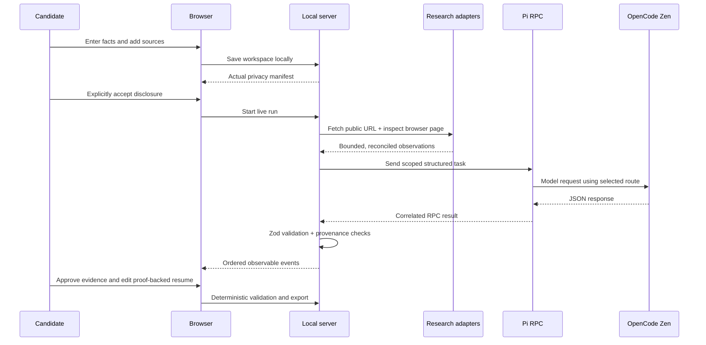

# GenForge architecture

GenForge is a local, desktop-first Next.js application. The browser coordinates
the five-workspace experience; server-owned adapters enforce privacy, storage,
research, AI, and export boundaries.

## System map

## End-to-end sequence

## Ownership boundaries

| Concern | Owner | Why |
| --- | --- | --- |
| Candidate facts | Browser + local storage | The user controls source facts and contact details |
| Upload path and limits | Server storage adapter | Prevents path traversal, symlink traversal, and oversized files |
| Public research | Server adapters | Direct fetch and Playwright inspection are safety-checked and bounded |
| Model routing | Pi RPC client | Makes provider, model, thinking level, timeout, and cancellation observable |
| Structured truth | Zod/domain layer | Invalid model output cannot become a domain object |
| Resume inclusion | Evidence review + ATS validator | Only approved source-backed claims can be included |
| Final files | Deterministic exporters | Export does not ask a model to rewrite content |

## Workspace and recovery model

Workspaces are versioned JSON records. Writes are serialized per workspace and
use a temporary file followed by rename, so an interrupted write cannot leave a
half-written record. Attachments and run JSONL are stored outside the repository
with restrictive file modes.

Runs expose stable event IDs through SSE. A reconnect can send `Last-Event-ID`
to replay missed events in order. Cancellation propagates from the route to an
`AbortController`, then to the Pi RPC client and child process.

Provider errors, blocked or oversized pages, invalid structured output, and
browser failures remain visible and retryable. GenForge never reports a fake
successful AI result to hide an unavailable dependency.

## Public-safe deployment boundary

The app is intentionally not a hosted multi-user service. A public clone gets
the application code and synthetic fixtures, while each user supplies their own
`.env.local`, Pi installation, OpenCode key, and local data directory. The
server binds to loopback by default and the browser never receives the key.
